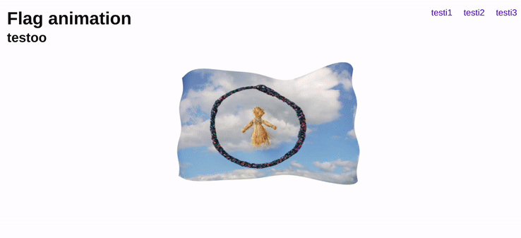

# 3d FLAG / THREE js 

### Adapting the animation from this project i did yesterday, into react:

<br>

[3d flag first test with vanilla js](https://github.com/nadiamariduena/3d-waving-flag-threejs)

[](https://github.com/nadiamariduena/3d-waving-flag-threejs)

<br>
<br>

##### START BY INSTALLING three.js

> npm i three


```javascript


```