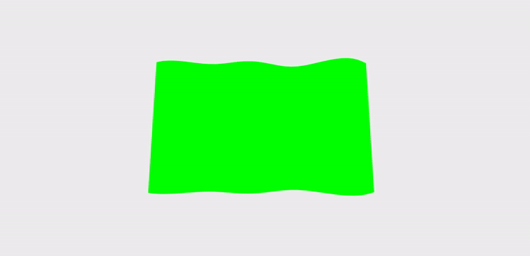

# 3d FLAG / THREE js

### Adapting the animation from this project i did yesterday, into react:

<br>

[3d flag first test with vanilla js](https://github.com/nadiamariduena/3d-waving-flag-threejs)

[](https://github.com/nadiamariduena/3d-waving-flag-threejs)

<br>
<br>

##### START BY INSTALLING three.js

> npm i three

- I advice you to follow the tutorial to get familiar with the code

[3d flag by superHi](https://www.superhi.com/video/how-to-make-a-3d-waving-flag-using-three-js-webgl-and-javascript)

- Afterwards follow the instructions from this website

[3d flag adapted to React](https://blog.bitsrc.io/starting-with-react-16-and-three-js-in-5-minutes-3079b8829817)

<br>
<br>
<br>

## THE TRICK is to wrap the vanilla javascript code inside a componentDidMount()

- THIS IS NOT MY CODE but their example

```javascript
import React, { Component } from "react";
import ReactDOM from "react-dom";
import * as THREE from "three";
class App extends Component {
  //
  //
  // wrapping the JS code here:
  //
  componentDidMount() {
    var scene = new THREE.Scene();
    var camera = new THREE.PerspectiveCamera(
      75,
      window.innerWidth / window.innerHeight,
      0.1,
      1000
    );
    var renderer = new THREE.WebGLRenderer();
    renderer.setSize(window.innerWidth, window.innerHeight);
    // document.body.appendChild( renderer.domElement );
    // use ref as a mount point of the Three.js scene instead of the document.body
    this.mount.appendChild(renderer.domElement);
    var geometry = new THREE.BoxGeometry(1, 1, 1);
    var material = new THREE.MeshBasicMaterial({ color: 0x00ff00 });
    var cube = new THREE.Mesh(geometry, material);
    scene.add(cube);
    camera.position.z = 5;
    var animate = function () {
      requestAnimationFrame(animate);
      cube.rotation.x += 0.01;
      cube.rotation.y += 0.01;
      renderer.render(scene, camera);
    };
    animate();
  }
  //
  //
  // wrapping the JS code, end:
  //
  render() {
    return <div ref={(ref) => (this.mount = ref)} />;
  }
}
const rootElement = document.getElementById("root");
ReactDOM.render(<App />, rootElement);
```

<br>

### SINCE MY CODE IS A BIT DIFFERENT ...

- I replaced few things, for example in the react adaptation website they tell you to replace line 11:

```javascript
// from this
document.body.appendChild(renderer.domElement);
//  to this
this.mount.appendChild(renderer.domElement);
```

#### BUT SINCE I HAVE A SECTION with a class, i added this:

```javascript
// 1
const section = document.querySelector("section.flag");
//
//
// document.body.appendChild( renderer.domElement );
// use ref as a mount point of the Three.js scene instead of the document.body
// 2
section.appendChild(renderer.domElement);
//
//
  //
  //------------------
  //
  render() {
    //   3
    return <section ref={(ref) => (this.mount = ref)} className="flag" />;
  }
}
//
//
//
// the styles
  section.flag {
    width: 100vw;
    height: 100vh;
    background-color: rgb(236, 236, 236);
  }
```

<br>
<br>

#### AFTER MAKING THE CONNECTION

- I JUST NEED TO ADD THE CODE I HAD

```javascript
import React, { Component } from "react";
import ReactDOM from "react-dom";
import * as THREE from "three";
//
//
class App extends Component {
  //
  //
  componentDidMount() {
    //
    const section = document.querySelector("section.flag");

    //
    var scene = new THREE.Scene();
    var camera = new THREE.PerspectiveCamera(
      75,
      window.innerWidth / window.innerHeight,
      0.1,
      1000
    );
    //
    var renderer = new THREE.WebGLRenderer({
      // 7 adding the alpha transparency
      alpha: true,
      antialias: true, //8 this will smooth the edges of the cube
    });
    renderer.setSize(window.innerWidth, window.innerHeight);
    // document.body.appendChild( renderer.domElement );
    // use ref as a mount point of the Three.js scene instead of the document.body
    section.appendChild(renderer.domElement);
    //
    //
    const loader = new THREE.TextureLoader();
    //
    //
    //
    // THREE.PlaneGeometry(5, 3); the 5 stands for width and 3 for height
    //const geometry = new THREE.PlaneGeometry(5, 2.5, 20, 15);
    const geometry = new THREE.PlaneGeometry(5, 3, 50, 30);
    // it will increase the segments in the geometry
    // its related to this   const waveX1 = 0.1 * Math.sin(dots_vertices.x * 2 + t_timeClock);
    //
    //
    var material = new THREE.MeshBasicMaterial({
      color: 0x00ff00,
      //   the following doesnt work , so use the color: 0x00ff00,
      map: loader.load("./src/img/NataliaSamoilova_metalmagazine-10.jpg"),
    });
    //
    //
    //
    //
    var cube = new THREE.Mesh(geometry, material);
    scene.add(cube);
    //
    //
    // new rotation
    cube.rotation.set(-0.1, 0, 0);
    // x direction y direction and z
    //
    // this will increase the flag, actually is like zooming, the less the bigger
    camera.position.z = 4;
    //
    //
    //by default its not doing anything, however inside the animate function you will be using it
    // its going to wave the flag smoothly
    const clock = new THREE.Clock();
    //
    //
    function animate() {
      // for each time it animates, i want to get a progress of the clock
      const t_timeClock = clock.getElapsedTime();
      //
      // so if x is the thing that moves, i want to add the t_timeClock
      //
      //
      // With the vertices we are going to grab all the points /vertices withing the cube/flag
      // We are going to move them in a sine "curve"
      // the map is going to make something for every single point, so each point is going to do a partcular thing, moving up down etc
      cube.geometry.vertices.map((dots_vertices) => {
        //
        //
        const waveX1 = 0.1 * Math.sin(dots_vertices.x * 2 + t_timeClock);
        // 2.5 will make the wave huge and very close to the user, 0.5 is flat , 0.1 even more flattened
        //
        //
        // second wave
        const waveX2 = 0.15 * Math.sin(dots_vertices.x * 3 + t_timeClock * 2);
        // 0.15 is less than 0.25 , 0.25 corresponds to half of the first wave, so this 2 wave is a little wave
        // const waveX2 = 0.5 * Math.sin(dots_vertices.x * 3 + t_timeClock * 2);
        // * 3  the waves , so this wave runs on 3 in amplitude and moves twice as quick
        //
        //
        // 3 wave but in the Y direction
        // const waveY1 = 0.1 * Math.sin(dots_vertices.y * 6 + t_timeClock * 0.1); //to slowdown the time t_timeClock * 0.5);
        //
        // dots_vertices.z = waveX1 + waveX2 + waveY1;
        dots_vertices.z = waveX1 + waveX2;
      });

      //
      // // its going to wave the flag smoothly
      cube.geometry.verticesNeedUpdate = true;
      //
      requestAnimationFrame(animate);
      renderer.render(scene, camera);
    }
    //
    //
    animate();
    //
    //
    //
    //
  }
  //
  //------------------
  //
  render() {
    return <section ref={(ref) => (this.mount = ref)} className="flag" />;
  }
}

//
export default App;
```

<br>
<br>

## ONLY PROBLEM ⚠️

- THE LOADER for the image doesnt seem to work, so i will have to find another solution

<!--
Unable to load a texture

https://spectrum.chat/react-three-fiber/general/unable-to-load-a-texture~42da2b2a-4360-4fc1-8e8f-c791d14840fc
 -->

```javascript
//
const loader = new THREE.TextureLoader();
//

var material = new THREE.MeshBasicMaterial({
  // color: 0x00ff00,

  map: loader.load("./src/img/NataliaSamoilova_metalmagazine-10.jpg"),
});
```

[](https://github.com/nadiamariduena/3d-waving-flag-threejs)

### STUPID ERROR

- SO AFTER SEARCHING for the solution, i found out that the image issue was related to the path in the image
  <br>
- ALSO
  <br>
  > KEEP IN MIND that its grabbing the images from the public/images folder not the src

<br>

##### Explanation from stackoverflow ⚠️

[3React + three.js: Error thrown by TextureLoader when trying to loading image
](https://stackoverflow.com/questions/51585734/react-three-js-error-thrown-by-textureloader-when-trying-to-loading-image)

> _From what directory is your web server being run?_

> If your web server is running from say, the /public directory, then you will likely need to update your image path that is passed to your textureLoader's load method as follows:

> textureLoader.load('/animation/js/img/texture1.png',

### So I copied the img folder and added it to the public then i changed the path like so:

```javascript
var material = new THREE.MeshBasicMaterial({
  // color: 0x00ff00,
  map: loader.load("/img/NataliaSamoilova_metalmagazine-10.jpg"),
});
```

<br>
<br>

[]()
